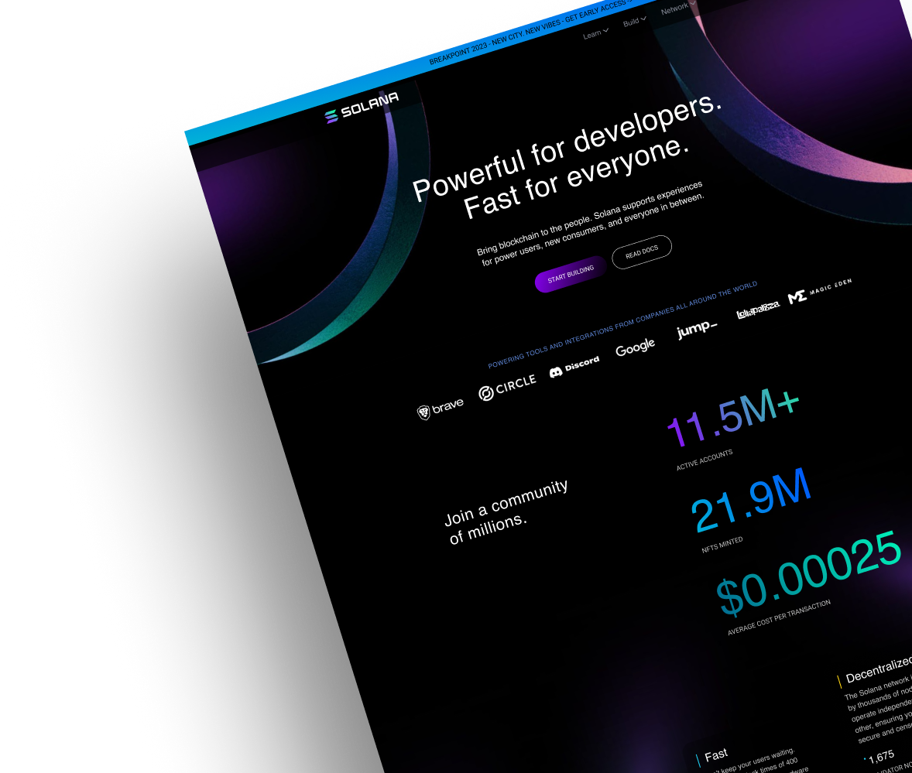
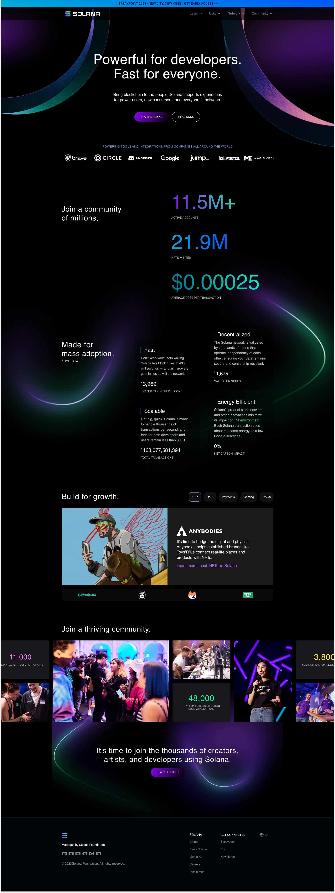
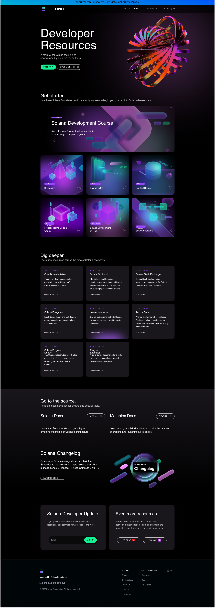

# Solana Landing – Figma-to-Code Blockchain Website

## Project Cover:


## 🚀 Project Overview

A pixel-perfect recreation of the [Solana Blockchain Development Website Landing Page](https://www.figma.com/community/file/1226186695193531711/solana-blockchain-development-website-landing-page) designed by **@duncanoluwaseun**. This Figma-to-Code project demonstrates the translation of complex, modern blockchain brand aesthetics into production-ready Next.js code.

**The Goal:** Showcase the ability to transform high-fidelity Figma designs into performant, responsive, and interactive web experiences while preserving the original design's visual integrity and brand identity.

**Live Demo:** [solana-landing-clone-jet.vercel.app](https://solana-landing-clone-jet.vercel.app/)

**Original Design:** [Figma Community File](https://www.figma.com/community/file/1226186695193531711/solana-blockchain-development-website-landing-page)

## ✨ Signature Modules

| Area                        | What It Delivers                                                                                 |
| --------------------------- | ------------------------------------------------------------------------------------------------ |
| **Cinematic Hero**          | 3D metallic SVG rings with gradients, ambient glows, and entrance animations matching Solana's brand. |
| **Logo Ticker**             | Infinite marquee with partner logos (Brave, Circle, Discord, Google) and gradient edge masks.   |
| **Stats Section**           | Animated counters with gradient text displaying real-time Solana network statistics.            |
| **Feature Grid**            | 2×2 bento grid with live data counters, colored borders, and responsive layout.                 |
| **Developer Resources**     | Tabbed case study cards showcasing NFTs, DeFi, Payments, Gaming, and DAOs ecosystems.           |
| **Community Grid**          | Bento-style image/stats mosaic highlighting hackathon and conference participation.             |
| **Build Page**              | Complete secondary page with animated 3D toroid, course cards, and resource documentation.      |

## 🛠️ Tech Stack

* **Framework:** Next.js 16 App Router with React 19 server + client components
* **Styling:** Tailwind CSS v4 with custom design tokens and utility classes
* **Animations:** Framer Motion for entrance effects, scroll triggers, and micro-interactions
* **UI Components:** Custom SVG graphics, animated counters, and responsive layouts
* **Typography:** DM Sans for headlines, system fonts for body text
* **Icons:** Lucide React for interface icons, custom SVG logos for partners

## 🎯 Experience Pillars

1. **Brand Fidelity** – Precise color matching (#9945FF purple, #14F195 green, #00D1FF cyan) and gradient implementations preserve Solana's identity.
2. **3D Visual Language** – SVG metallic rings with multi-stop gradients, glows, and shadows create depth without heavy assets.
3. **Motion Design** – Staggered reveals, counter animations, and infinite marquees add polish and engagement.
4. **Responsive Excellence** – Mobile-first approach with breakpoint-specific layouts for seamless experiences across devices.

## 🧠 Design Decisions

* **SVG-based 3D rings:** Pure SVG with linear gradients and blur filters recreate the metallic torus aesthetic without images.
* **Animated counters:** IntersectionObserver triggers number animations only when stats enter the viewport, optimizing performance.
* **Gradient text:** CSS `background-clip: text` achieves Solana's signature gradient typography without custom fonts.
* **Infinite marquee:** CSS mask-image fades edges while Framer Motion handles smooth infinite loop animation.
* **Dark theme base:** Pure black (#000) background with white/10 borders creates the deep space aesthetic.
* **Section spacing:** Consistent 80-112px vertical padding matches Figma's 8px grid system.

## 📂 Project Structure

```
src/
├─ app/
│  ├─ page.tsx              # Main landing page with all sections
│  ├─ build/
│  │  └─ page.tsx           # Developer Resources secondary page
│  ├─ globals.css           # Tailwind v4 + custom CSS variables
│  └─ layout.tsx            # Root layout with fonts and metadata
├─ components/
│  ├─ AnimatedCounter.tsx   # Reusable number animation component
│  ├─ CommunitySection.tsx  # Bento grid with stats and images
│  ├─ DeveloperResources.tsx # Tabbed case study showcase
│  ├─ FeatureGrid.tsx       # 2x2 live data features
│  ├─ Footer.tsx            # Site footer with links and socials
│  ├─ Hero.tsx              # 3D rings hero with CTAs
│  ├─ LogoTicker.tsx        # Partner logos infinite marquee
│  ├─ Navbar.tsx            # Fixed nav with mobile menu
│  ├─ StatsSection.tsx      # Gradient stats counters
│  └─ build/
│     ├─ BuildHero.tsx          # Dev resources hero with 3D toroid
│     ├─ ChangelogSection.tsx   # Solana changelog embed
│     ├─ DigDeeperSection.tsx   # Documentation links grid
│     ├─ GetStartedSection.tsx  # Course cards grid
│     ├─ GoToSourceSection.tsx  # Docs quick links
│     └─ NewsletterSection.tsx  # Email signup + resource links
└─ lib/
   └─ utils.ts              # Tailwind merge utilities
```

## 🧪 Feature Highlights

* **3D Metallic Rings** – Hero SVG rings with 5-stop gradients, blur filters, and entrance animations.
* **Animated Statistics** – Numbers count up from 0 when scrolled into view with configurable duration and formatting.
* **Infinite Logo Carousel** – Seamless partner logo loop with CSS gradient masks at edges.
* **Interactive Tabs** – Case study tabs with smooth content transitions and ecosystem categorization.
* **Responsive Navigation** – Sticky navbar with backdrop blur, mobile hamburger menu, and active state indicators.
* **Bento Community Grid** – 5-column mosaic mixing stat cards, logos, and gradient placeholders.
* **Multi-page Architecture** – Separate `/build` route demonstrating full developer resources experience.
* **Motion Choreography** – Staggered `whileInView` animations create polished scroll-triggered reveals.

## 🏁 Run the Project Locally

```bash
git clone https://github.com/renatogg-dev/solana-landing-clone.git
cd pixel-perfect-landing
npm install
npm run dev
```

Visit `http://localhost:3000` to explore the landing page and `http://localhost:3000/build` to view the developer resources page.

## 📦 Scripts

| Command       | Description                                            |
| ------------- | ------------------------------------------------------ |
| npm run dev   | Launches the local Next.js dev server with hot reload. |
| npm run build | Creates an optimized production build.                 |
| npm start     | Runs the production build locally.                     |
| npm run lint  | Executes ESLint using the shared Next.js config.       |

## 🗺️ Roadmap Ideas

* Add real Solana network data fetching via RPC endpoints for live statistics.
* Implement actual community images instead of gradient placeholders.
* Build out remaining nav dropdown menus (Learn, Network, Community).
* Add dark/light theme toggle with CSS variables.
* Create additional pages: Ecosystem, Validators, NFT Gallery.
* Integrate Solana wallet connection for interactive demos.
* Add page transition animations between routes.

## 📸 Reference Designs

<table>
  <tr>
    <td></td>
    <td></td>
  </tr>
  <tr>
    <td></td>
    <td></td>
  </tr>
</table>

---

Pixel-perfect recreation of the Solana landing page design by [@duncanoluwaseun](https://www.figma.com/community/file/1226186695193531711).
